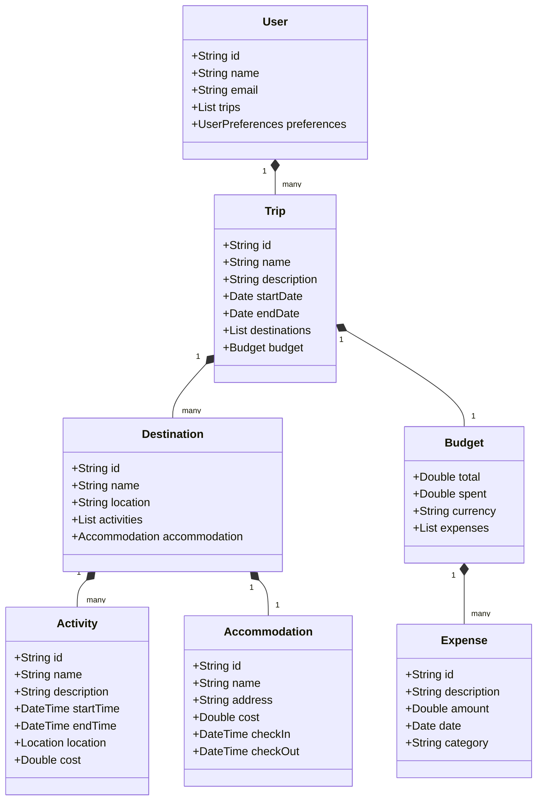

# Diseño de Travel Planner

## Arquitectura

La aplicación sigue el patrón de arquitectura MVVM (Model-View-ViewModel) junto con Clean Architecture para mantener un código limpio y mantenible.

### Capas de la Aplicación

1. **Presentación (UI)**
   - Activities/Fragments
   - Composables
   - ViewModels
   - Estados UI

2. **Dominio**
   - Casos de Uso
   - Modelos de Dominio
   - Interfaces de Repositorio

3. **Datos**
   - Implementaciones de Repositorio
   - Fuentes de Datos
   - Modelos de Datos

## Modelo de Datos

## Tecnologías Principales

1. **UI/UX**
   - Jetpack Compose
   - Material Design 3
   - Navigation Component

2. **Persistencia de Datos**
   - Room Database
   - DataStore Preferences

3. **Inyección de Dependencias**
   - Dagger Hilt

4. **Concurrencia**
   - Coroutines
   - Flow

5. **Networking**
   - Retrofit
   - OkHttp

## Patrones de Diseño

1. Repository Pattern
2. Factory Pattern
3. Observer Pattern (Flow)
4. Dependency Injection
5. Builder Pattern

## Estrategia de Testing

1. **Unit Tests**
   - ViewModels
   - Use Cases
   - Repositories

2. **Integration Tests**
   - Database
   - API

3. **UI Tests**
   - Compose UI Testing
   - End-to-End Tests 